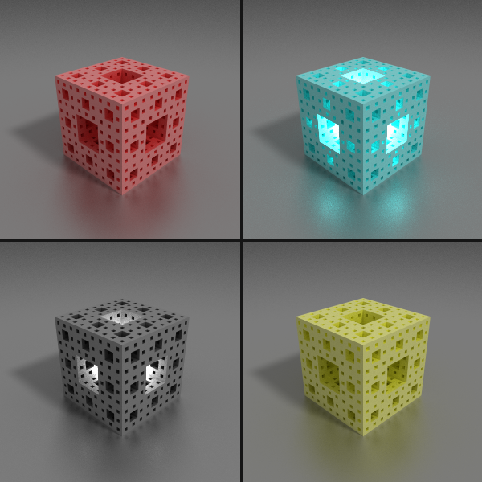

# Voxel Path Tracer
A CPU-only path tracer for rendering voxel grids.

## Features
* Unidirectional path tracing
* Based on fast voxel traversal algorithm (DDA)
* Perspective camera
* Multiple sampling
* Supports color, emission and reflectivity
* Sun with direction and color
* Simple API
* No thrid party dependencies

## Future ideas
* Transparency support