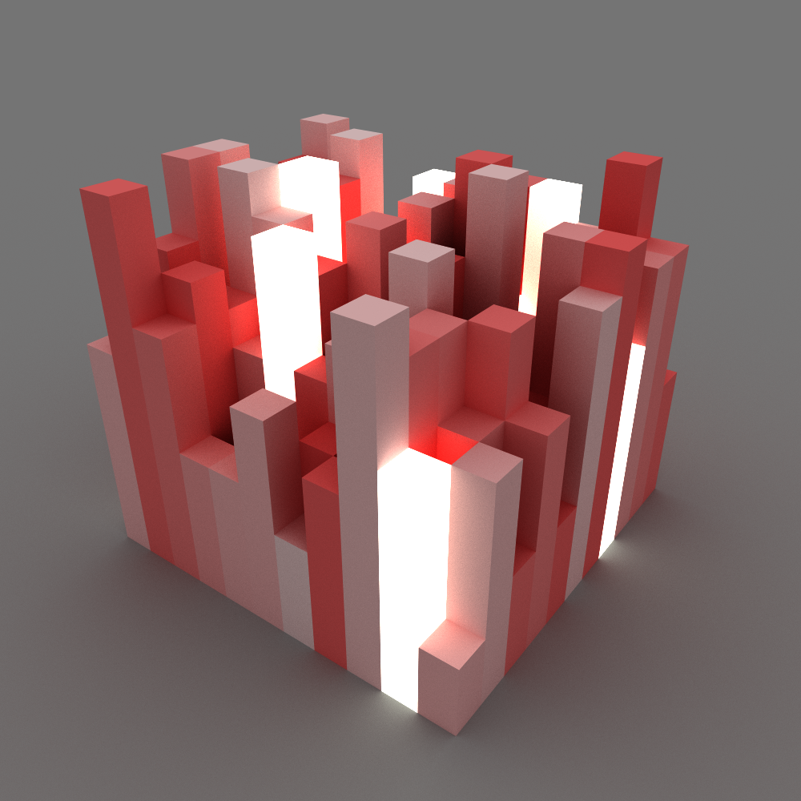

# Voxel Path Tracer
A CPU-only path tracer for rendering voxel grids.


* [Features](#features)
* [Future ideas](#future-ideas)
* [Examples](#examples)
    - [BasicExample](#basicexample)
* [Dev log](#dev-log)
    - [1. Diffuse color](#1-diffuse-color)
    - [2. Emissive surfaces](#2-emissive-surfaces)
    - [3. Hard shadows](#3-hard-shadows)
    - [4. Reflections](#4-reflections)
    - [5. Soft shadows](#5-soft-shadows)

## Features
* Unidirectional path tracing
* Based on fast voxel traversal algorithm (DDA)
* Perspective camera
* Multiple sampling
* Supports color, emission and reflectivity
* Sun with direction and color
* Simple API
* No thrid party dependencies

## Future ideas
* Transparency support

## Examples
#### BasicExample
Rnders an image with some predefined settings.

####MengerSpongeExample
Renders a menger sponge (like in the picture above). The program is executed using command line and has 
the following options:
```
 -i, --iterations    (Default: 3) Number of iterations in range [1, 6]
 -s, --samples       (Default: 300) Number of render samples
 -r, --resolution    (Default: 500) Resolution of rendered image
 -p, --path          (Default: image.png) Path where rendered image will be saved
 -l, --light         (Default: false) Add a light in the middle of the sponge
 -c, --color         (Default: Cyan) White, Gray, Black, Cyan, Yellow, Red, Green, Blue
 -d, --denoiser      (Default: false) Use median filter to reduce noise
 --help              Display the help screen.
 --version           Display version information.
```

## Dev log
#### 1. Diffuse color


#### 2. Emissive surfaces



#### 3. Hard shadows


#### 4. Reflections


#### 5. Soft shadows

